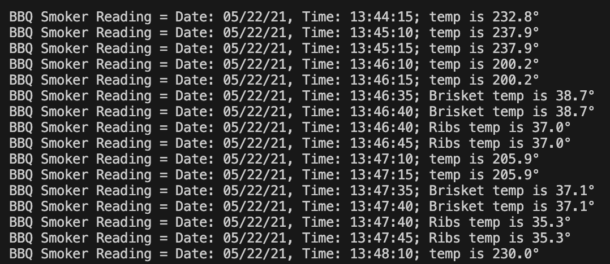
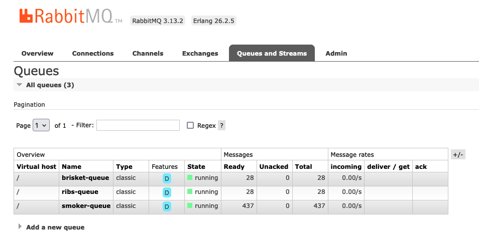

## streaming-05-smart-smoker

### Author: Brett Neely<br>Date: 5/27/2024</br>

### Objective:
> Use RabbitMQ to distribute tasks to multiple workers

One process will create task messages. Multiple worker processes will share the work.

## RabbitMQ Admin 

RabbitMQ comes with an admin panel. When you run the task emitter, reply y to open it. 

(Python makes it easy to open a web page - see the code to learn how.)

## Prerequisites
RabbitMQ and pika must be installed

## Start RabbitMQ in your terminal 
With Homebrew on Mac run this command in the terminal in the project:

``` 
brew services start rabbitmq
```

To stop RabbitMQ (once development / project is comlete):
``` 
brew services stop rabbitmq
```
## Execute the Producer
Run the emitter of tasks Python file in the project terminal:
```
python3 emitter_of_tasks.py
```

## Screenshot of the messages in the terminal
These messages are sent to three separate queues:
> smoker-queue, brisket-queue, ribs-queue



## Screenshot of separate queues in RabbitMQ Admin
After running the emitter_of_tasks.py file the messages are sent to three separate queues as seen on RabbitMQ Admin:
