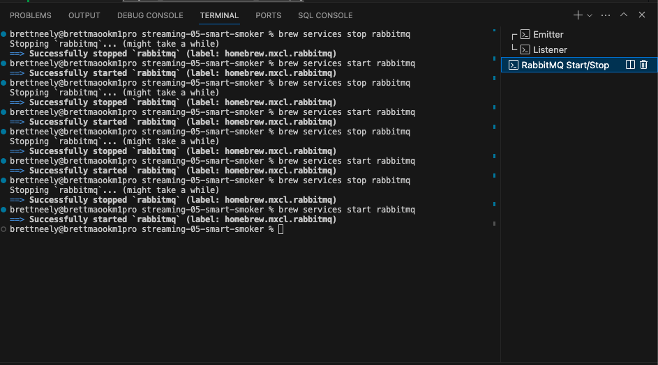

## streaming-05-smart-smoker

### Author: Brett Neely<br>Date: 5/27/2024</br>

### Objective:
> Use RabbitMQ to distribute tasks to multiple workers

One process will create task messages. Multiple worker processes will share the work.

## RabbitMQ Admin 

RabbitMQ comes with an admin panel. When you run the task emitter, reply y to open it. 

(Python makes it easy to open a web page - see the code to learn how.)

## Prerequisites
RabbitMQ and pika must be installed

## Start RabbitMQ in your terminal 
With Homebrew on Mac run this command in the terminal in the project:

``` 
brew services start rabbitmq
```

To stop RabbitMQ (once development / project is comlete):
``` 
brew services stop rabbitmq
```
## Execute the Producer
Run the emitter of tasks Python file in the project terminal:
```
python3 emitter_of_tasks.py
```

## Execute the Listener
Run the listening worker Python file in a new terminal (separate from the producer termina)
```
python3 listening_worker.py
```

## Screenshot of the messages in the terminal
These messages are sent to three separate queues:
> smoker-queue, brisket-queue, ribs-queue


## Screenshot of separate queues in RabbitMQ Admin
After running the emitter_of_tasks.py file the messages are sent to three separate queues as seen on RabbitMQ Admin:


## Screenshot of terminal setup

### For ease of use, open three terminals to run this project:
- One to run python3 emitter_of_tasks.py (renamed as Emitter in this screenshot) 
- Another to run python3 listening_worker.py (renamed as Listener in this screenshot)
- Another to start and stop RabbitMQ services with Brew (as mentioned above)



## Screenshot of alerts produced

### Smoker Alert:


### Brisket Alert


### Ribs Alert

